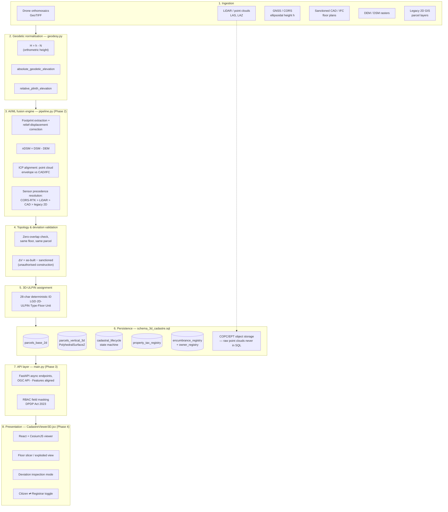

# Strata Cadastre — Architecture Overview
### SIH26011 · 3D ULPIN Generation and Vertical Property Mapping System

This is the Phase 1 deliverable: the end-to-end workflow this system implements, and how each stage maps back to the brief's non-negotiable constraints. `geodesy.py` and `schema_3d_cadastre.sql` (also in this delivery) are the first two pieces of it. Phases 2–4 (the fusion pipeline, the FastAPI + ULPIN generator service, and the CesiumJS viewer) build on top of what's here.

## Pipeline

## Stage-by-stage, mapped to the brief's non-negotiables

| Stage | What it does | Constraint it satisfies |
|---|---|---|
| Geodetic normalisation | Converts every raw GNSS/CORS ellipsoidal fix to orthometric height via a documented geoid model; emits both `absolute_geodetic_elevation` and `relative_plinth_elevation` per spatial node | §1.1 |
| Fusion engine (Phase 2) | Never infers floor count from CV height slicing alone; fuses LiDAR nDSM with sanctioned CAD/IFC via ICP | §1.2 |
| Fusion engine (Phase 2) | Resolves conflicting boundaries by CORS-RTK > LiDAR > CAD > legacy 2D; every spatial node carries `source_confidence_score` + `positional_uncertainty_cm` | §1.3 (columns already in `schema_3d_cadastre.sql`) |
| Persistence | `parcels_base_2d` (UDS / 2D ULPIN) + `parcels_vertical_3d` (exclusive volumetric right) as two linked tables, not one flattened one | §1.4 |
| ULPIN assignment | 28-character deterministic ID exactly as specified (Phase 3 builds the generator; the schema already validates the shape via a `CHECK` constraint) | §1.5 |
| Persistence | Point clouds referenced via `point_cloud_references`, never stored as rows; `geometry_3d` is `PolyhedralSurfaceZ` in PostGIS 3D | §1.6 |
| API + persistence | Two DB roles + a `v_public_property` view that only ever exposes the public-tier fields; registrar-tier tables are never granted to the public role | §1.7 |

## What's built vs. what's next

- **Built (Phase 1, this delivery):** the schema, the geodesy module, this overview.
- **Phase 2:** `pipeline.py` — footprint extraction, LiDAR/CAD fusion, deviation detection, run against a synthetic sample dataset since real drone/LiDAR/CAD data won't be on hand at the hackathon.
- **Phase 3:** `main.py` — the FastAPI endpoints and the actual 3D-ULPIN generator (the schema validates the ID's shape; Phase 3 is what produces one).
- **Phase 4:** `CadastreViewer3D.jsx` — React + CesiumJS, entity/glTF rendering against a placeholder Cesium ion token.

Say "continue to Phase 2" when ready.
